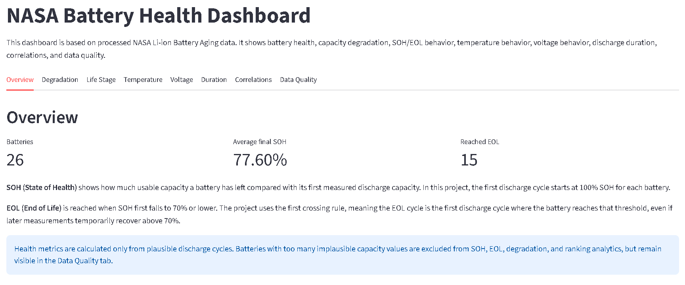
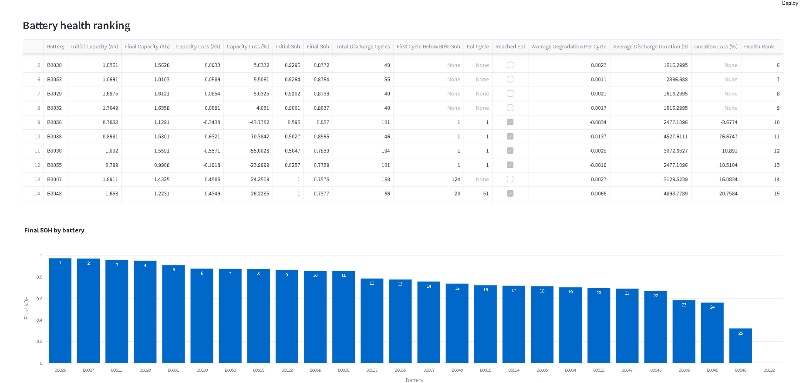
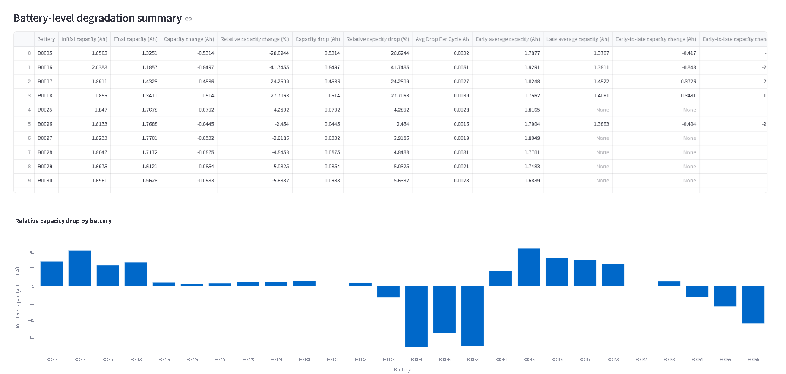
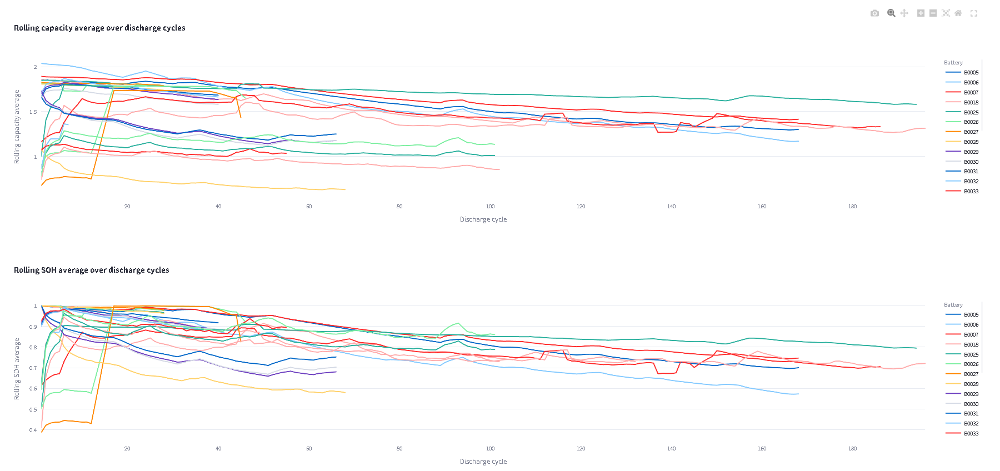
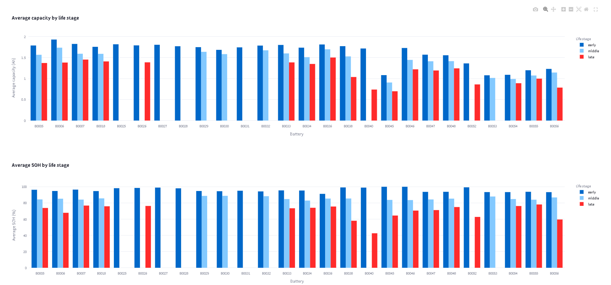
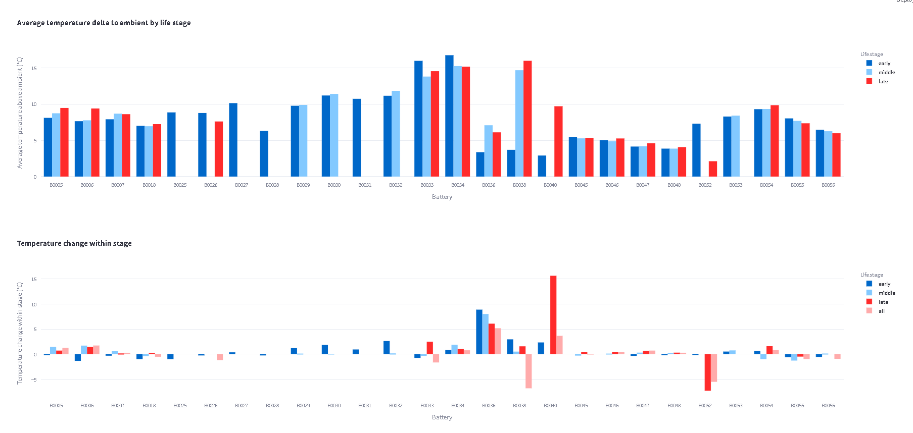
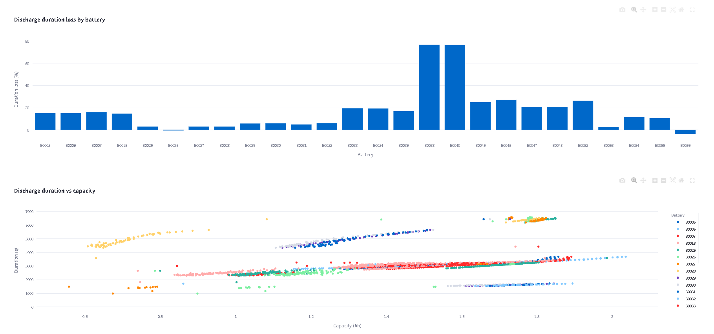
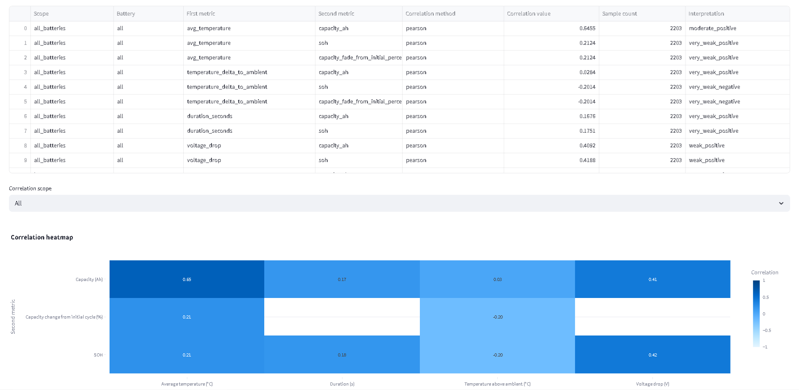
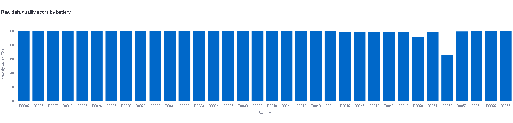
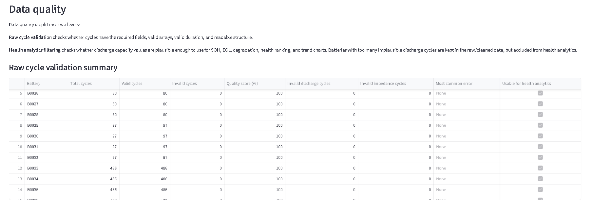

# NASA Battery Cloud Pipeline

A data engineering project for processing the NASA Li-ion Battery Aging dataset.

The project downloads a nested ZIP dataset, extracts MATLAB `.mat` battery files, converts raw battery cycle data into structured Parquet datasets, filters unreliable discharge cycles, calculates battery health analytics, and visualizes the final outputs in a Streamlit dashboard.

The main focus is **data processing**, **data validation**, **battery health analytics**, **dashboard-ready Parquet outputs**, and **cloud-ready pipeline architecture**.

---

## Project Goals

The goal of this project is to build a realistic data pipeline that can:

1. ingest a nested raw dataset archive,
2. extract battery `.mat` files,
3. parse charge, discharge, and impedance cycles,
4. validate raw cycle structure,
5. normalize raw MATLAB data into clean tabular outputs,
6. filter implausible discharge capacity records,
7. calculate SOH, EOL, degradation, duration, voltage, temperature, and correlation metrics,
8. write all outputs as Parquet files,
9. serve a local Streamlit dashboard,
10. prepare the pipeline for AWS execution using S3, Docker, and ECS/Fargate.

---

## Dataset

The project uses the NASA Li-ion Battery Aging dataset.

The raw dataset is provided as one outer ZIP archive that contains multiple inner ZIP files. Each inner archive contains several `.mat` battery files.

Each battery file contains a top-level `cycle` array with operation types such as:

- `charge`
- `discharge`
- `impedance`

Each cycle contains metadata and time-series measurement arrays such as voltage, current, temperature, time, capacity, and impedance-related fields.

The different battery groups were tested under different experimental conditions, including different ambient temperatures, discharge profiles, cutoff voltages, and stopping conditions. Some battery groups also contain abnormal low-capacity or crashed experiment records, so health filtering is required before SOH and degradation analytics are calculated.

---

## Architecture

```text
External NASA ZIP archive
        |
        v
ingestion/
        |
        |-- download outer ZIP
        |-- extract nested ZIP files
        |-- extract .mat battery files
        v
data/raw/
        |
        v
pipeline/
        |
        |-- parse MATLAB cycle structures
        |-- validate cycle fields
        |-- build cleaned Parquet outputs
        |-- filter implausible health cycles
        |-- calculate analytics
        |-- create dashboard manifest
        v
data/
  cleaned/
  quality/
  analytics/
  dashboard/
        |
        v
dashboard/
        |
        v
Streamlit dashboard
```

Cloud-ready pipeline flow:

```text
S3 raw .mat files
        |
        v
Dockerized pipeline task
        |
        v
ECS/Fargate processing
        |
        v
S3 output Parquet files
        |
        v
Streamlit dashboard hosting
```

---

## Repository Structure

```text
ingestion/
  config.py
  download.py
  extract.py
  main.py

pipeline/
  raw/
    mat_loader.py
    cycle_parser.py
  validation/
    cycle_validation.py
  transforms/
    build_cycle_summary.py
    build_discharge_cycles.py
    build_discharge_cycles_health.py
  analytics/
    battery_health.py
    degradation.py
    rolling_degradation.py
    soh_eol.py
    life_stage.py
    temperature.py
    voltage.py
    discharge_duration.py
    correlations.py
    data_quality.py
    dashboard_manifest.py
  main.py
  cloud_main.py
  s3_io.py

dashboard/
  app.py
  config.py

scripts/
  validate_outputs.py
  inspect_capacity_plausibility.py
  build_*_local.py

docs/
  local_run.md
  data_dictionary.md
  aws_deploy.md
  dashboard_guide.md
  images/

data/
  raw/
  cleaned/
  quality/
  analytics/
  dashboard/
```

---

## Main Pipeline Stages

### 1. Ingestion

The ingestion module downloads the external NASA archive and extracts all `.mat` files.

```bash
python -m ingestion.main
```

The ingestion logic supports:

- one outer ZIP archive,
- multiple nested ZIP files,
- extraction of all `.mat` files,
- duplicate handling using SHA-256 hashes,
- configurable overwrite behavior.

Configuration is provided through `.env`.

---

### 2. Raw MATLAB Parsing

The parser reads each `.mat` file and extracts:

- battery ID,
- cycle index,
- operation type,
- start time,
- ambient temperature,
- cycle data fields,
- time-series arrays.

The raw MATLAB arrays are normalized into consistent one-dimensional NumPy arrays where appropriate.

---

### 3. Cycle Validation

The validation layer checks for structural problems such as:

- missing required fields,
- empty arrays,
- non-monotonic time arrays,
- mismatched measurement array lengths,
- invalid capacity values,
- invalid duration values.

Invalid raw cycles are written to:

```text
data/quality/invalid_cycles.parquet
```

---

### 4. Cleaned Cycle Outputs

The first main cleaned table is:

```text
data/cleaned/cycle_summary.parquet
```

Grain:

```text
one row per raw cycle
```

It includes cycle-level metrics such as:

- operation type,
- duration,
- sample count,
- capacity,
- voltage statistics,
- temperature statistics,
- ambient temperature difference,
- validation status.

---

### 5. Discharge Cycle Table

The full discharge table is:

```text
data/cleaned/discharge_cycles.parquet
```

Grain:

```text
one row per discharge cycle
```

This table keeps all discharge cycles, including cycles that may later be excluded from health analytics.

---

### 6. Health-Valid Discharge Filtering

Some batteries contain implausible discharge capacity records, for example zero capacity, extremely low capacity, unrealistically high capacity, or large cycle-to-cycle jumps.

To prevent these records from distorting health analytics, the pipeline creates:

```text
data/cleaned/discharge_cycles_health.parquet
```

This table contains only health-valid discharge cycles from batteries that pass battery-level plausibility checks.

Filtering rules include:

```text
capacity_ah > 0
capacity_ah >= 0.5
capacity_ah <= 2.2
absolute cycle-to-cycle capacity jump <= 0.5 Ah
duration_seconds > 0
```

Battery-level filtering requires:

```text
at least 20 plausible discharge cycles
bad cycle percentage below 20%
```

Excluded batteries are documented in:

```text
data/quality/health_quality_summary.parquet
```

This keeps the project transparent: bad or abnormal records are not deleted, but they are excluded from SOH, EOL, degradation, ranking, and trend analytics.

---

## SOH and EOL Logic

### SOH

SOH means **State of Health**.

In this project, SOH is calculated using the maximum plausible discharge capacity as the reference capacity:

```text
SOH = capacity_ah / reference_capacity_ah
```

This prevents SOH values above 100% when the first discharge cycle is incomplete, abnormal, or not representative.

### EOL

EOL means **End of Life**.

The pipeline uses a first-crossing rule:

```text
EOL = first health-valid discharge cycle where SOH <= 70%
```

This means that if a battery crosses below 70% SOH and later temporarily recovers above 70%, it is still considered to have reached EOL at the first crossing.

---

## Main Output Files

### Cleaned Outputs

```text
data/cleaned/cycle_summary.parquet
data/cleaned/discharge_cycles.parquet
data/cleaned/discharge_cycles_health.parquet
```

### Quality Outputs

```text
data/quality/invalid_cycles.parquet
data/quality/health_quality_summary.parquet
```

### Analytics Outputs

```text
data/analytics/battery_health_summary.parquet
data/analytics/degradation_summary.parquet
data/analytics/rolling_degradation_summary.parquet
data/analytics/soh_eol_summary.parquet
data/analytics/life_stage_summary.parquet
data/analytics/temperature_summary.parquet
data/analytics/voltage_summary.parquet
data/analytics/discharge_duration_summary.parquet
data/analytics/correlation_summary.parquet
data/analytics/data_quality_summary.parquet
```

### Dashboard Output

```text
data/dashboard/dashboard_manifest.parquet
```

---

## Dashboard

The Streamlit dashboard visualizes the final Parquet outputs.

Run locally:

```bash
streamlit cache clear
streamlit run dashboard/app.py
```

Main dashboard sections:

- Overview
- Degradation
- Life Stage
- Temperature
- Voltage
- Duration
- Correlations
- Data Quality

The dashboard uses user-friendly labels instead of raw technical column names.

---

## Dashboard Screenshots

### Main Page



### Health Ranking



### Battery Degradation Summary



### Discharge Cycles Graph



### Life Stage Statistics



### Temperature Graphs



### Voltage Drop Graph


### Discharge Duration Graphs



### Correlations



### Data Quality Scores



### Data Quality Summary



---

## Local Setup

Create and activate a virtual environment:

```bash
python3 -m venv .venv
source .venv/bin/activate
```

Install dependencies:

```bash
pip install -r requirements-pipeline.txt
pip install -r requirements-ingestion.txt
pip install -r requirements-dashboard.txt
```

Create `.env`:

```bash
cp .env.example .env
```

Example `.env` values:

```env
AWS_REGION=eu-central-1
S3_BUCKET=

S3_RAW_PREFIX=raw/mat/
S3_CLEANED_PREFIX=output/cleaned/
S3_ANALYTICS_PREFIX=output/analytics/
S3_QUALITY_PREFIX=output/quality/
S3_DASHBOARD_PREFIX=output/dashboard/

LOCAL_DATA_DIR=data
DASHBOARD_DATA_DIR=data

LOG_LEVEL=INFO

SOURCE_ARCHIVE_URL=https://phm-datasets.s3.amazonaws.com/NASA/5.+Battery+Data+Set.zip
DOWNLOAD_LOCAL_DIR=data/downloads
RAW_LOCAL_DIR=data/raw
INGESTION_OVERWRITE=false
```

---

## Run Locally

### 1. Ingest dataset

```bash
python -m ingestion.main
```

### 2. Run pipeline

```bash
python -m pipeline.main
```

### 3. Validate outputs

```bash
python -m scripts.validate_outputs
```

Expected result:

```text
All required outputs are valid.
```

### 4. Run dashboard

```bash
streamlit cache clear
streamlit run dashboard/app.py
```

---

## Docker Pipeline Execution

Build the pipeline image:

```bash
docker build -f Dockerfile.pipeline -t nasa-battery-pipeline:local .
```

Run the pipeline with local data mounted into the container:

```bash
docker run --rm \
  --env-file .env \
  -v "$(pwd)/data:/app/data" \
  nasa-battery-pipeline:local
```

Validate outputs after Docker run:

```bash
python -m scripts.validate_outputs
```

---

## S3 Cloud Pipeline Wrapper

The project includes a cloud wrapper:

```bash
python -m pipeline.cloud_main
```

The cloud wrapper is designed to:

1. download raw `.mat` files from S3,
2. run the local pipeline inside the container,
3. upload cleaned, quality, analytics, and dashboard Parquet outputs back to S3.

S3 prefixes are configured through `.env`:

```env
S3_RAW_PREFIX=raw/mat/
S3_CLEANED_PREFIX=output/cleaned/
S3_ANALYTICS_PREFIX=output/analytics/
S3_QUALITY_PREFIX=output/quality/
S3_DASHBOARD_PREFIX=output/dashboard/
```

---

## Data Quality Strategy

This project uses two levels of data quality checks.

### Raw Cycle Validation

Checks whether raw cycles are structurally valid.

Output:

```text
data/quality/invalid_cycles.parquet
```

### Health Analytics Filtering

Checks whether discharge capacity values are plausible enough for SOH and degradation analytics.

Output:

```text
data/quality/health_quality_summary.parquet
```

This is important because the full dataset contains batteries tested under different conditions and some abnormal records. The project keeps those records in cleaned outputs but excludes them from health-specific analytics when necessary.

---

## Technical Highlights

- Python data pipeline
- MATLAB `.mat` parsing with SciPy
- NumPy array normalization
- Pandas transformations
- Parquet output with PyArrow
- Raw cycle validation
- Health-specific discharge filtering
- SOH and EOL analytics
- Rolling degradation metrics
- Correlation analysis
- Streamlit dashboard
- Plotly visualizations
- Dockerized pipeline
- S3-ready cloud wrapper

---

## Current Status

Implemented:

- nested ZIP ingestion,
- raw `.mat` extraction,
- raw MATLAB parsing,
- cycle validation,
- cleaned Parquet outputs,
- health-valid discharge filtering,
- battery health analytics,
- degradation analytics,
- rolling degradation analytics,
- SOH and EOL analytics,
- life-stage analytics,
- temperature analytics,
- voltage analytics,
- discharge duration analytics,
- correlation analytics,
- data quality outputs,
- dashboard manifest,
- local Streamlit dashboard,
- Dockerized local pipeline,
- S3 cloud pipeline wrapper.

Not implemented yet:

- ECS/Fargate task deployment,
- ECR image push,
- Lightsail dashboard deployment,
- final production AWS run,
- ML/RUL prediction model.

---

## Planned AWS Deployment

Planned deployment flow:

```text
S3 raw data
    -> ECR Docker image
    -> ECS Fargate one-time task
    -> S3 Parquet outputs
    -> Lightsail Streamlit dashboard
```

The pipeline is designed as a one-time batch processing workflow, not a continuously running streaming system.

---

## Notes

This project is focused on data engineering and analytics, not machine learning. ML/RUL prediction may be added later, but the current version focuses on reliable processing, validation, Parquet outputs, and dashboard-ready analytics.
